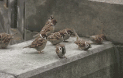

# Sparrow
## The Origins
After receiving our team assignment on Jan 19, we convened for our first group gathering to perform the important task of selecting the name for the drone project aimed at eliminating the burdensome task of warehouse inventorying. Our goal was to select a name that would channel the aerial nature and intelligent capabilities of a drone solution. To begin our little brainstorm, we sought out inspiration from other drone companies with enterprise systems. We didn't find anything too exciting, excpet for InventAIRy. 

We didn't want to mimic the clever incorporation of "air" into our name. The next best thing to us happened to animals that fly. We initially thought that incorporating bees into our name would be appropriate, given that within a bee hive there exists a role called "drone." Hummingbird was a different animal that seemed promising; this animal evoked a sense of constant motion and rapid, quick action. This option was eventually dismissed since hummingbirds are too cute. We needed something more sleek and powerful. Ravens and crows were considered, but ultimately we chose the sparrow. After not too much debate, we decided it was a keeper. Someone commented that they were also smart animals, which aligned with one of the goals for our solution.

Wikipedia also says that sparrows may be the most familiar of all wild birds worldwide. We find that to be rather fitting as familiarity breeds comfort. We hope that some time soon warehouse workers will find comfort with their sparrows flying around collecting inventory. Also, warehouse workers often lose their weekends because inventory stock taking is tedious. Let's save the weekend.

 

####\#SaveTheWeekend

-**Andrew (01/26)**
